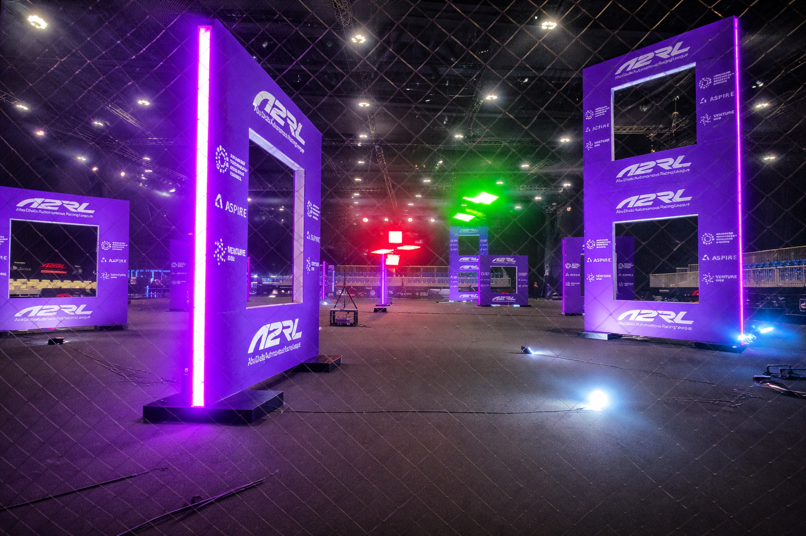

# CVAR-UPM Drone Course (ROS 2 + Aerostack2)

This repository contains the practical material for a drone course from **Universidad Politécnica de Madrid (UPM)**.
This course was developed by the **CVAR Group (Computer Vision & Aerial Robotics), UPM**:
https://cvar-upm.github.io/drone_racing_web/
The course is based on **ROS 2 Humble** and **[Aerostack2](https://aerostack2.github.io/)**, and focuses on both multirotor control and computer-vision tasks for autonomous drone racing in a gate-circuit simulation.

## Share This Repository

Use this QR code to quickly share the repository:

## Control

The control track covers ROS 2 interfaces, position/speed control, and smooth trajectory tracking through gates.

- Track README: [control/README.md](control/README.md)
- Installation: [control/docs/INSTALLATION.md](control/docs/INSTALLATION.md)
- References: [control/docs/REFERENCES.md](control/docs/REFERENCES.md)
- Exercise 1: Drone Position Control ([control/exercises/Exercise1.md](control/exercises/Exercise1.md))
- Exercise 2: Drone Speed Control ([control/exercises/Exercise2.md](control/exercises/Exercise2.md))
- Exercise 3: Smooth Trajectory Speed Control Through Gates ([control/exercises/Exercise3.md](control/exercises/Exercise3.md))

## Vision

The vision track focuses on perception tasks for gate understanding and camera localization.

- Track README: [vision/README.md](vision/README.md)
- Exercise 1: Gate Segmentation in Image ([vision/exercises/Exercise1.md](vision/exercises/Exercise1.md))
- Exercise 2: Gate Corner Detection in Image ([vision/exercises/Exercise2.md](vision/exercises/Exercise2.md))
- Exercise 3: Camera Localization from Gate Image and Known Gate Size ([vision/exercises/Exercise3.md](vision/exercises/Exercise3.md))

## Join Us

If you want to join the CVAR-UPM drone team, follow the process described in [JOIN_US.md](JOIN_US.md).

## Questions and Support

If you have questions, please use the official GitHub channels for this repository:

- Issues: https://github.com/cvar-upm-drone-team/project_cvar_upm_drone_course/issues
- Discussions: https://github.com/cvar-upm-drone-team/project_cvar_upm_drone_course/discussions
