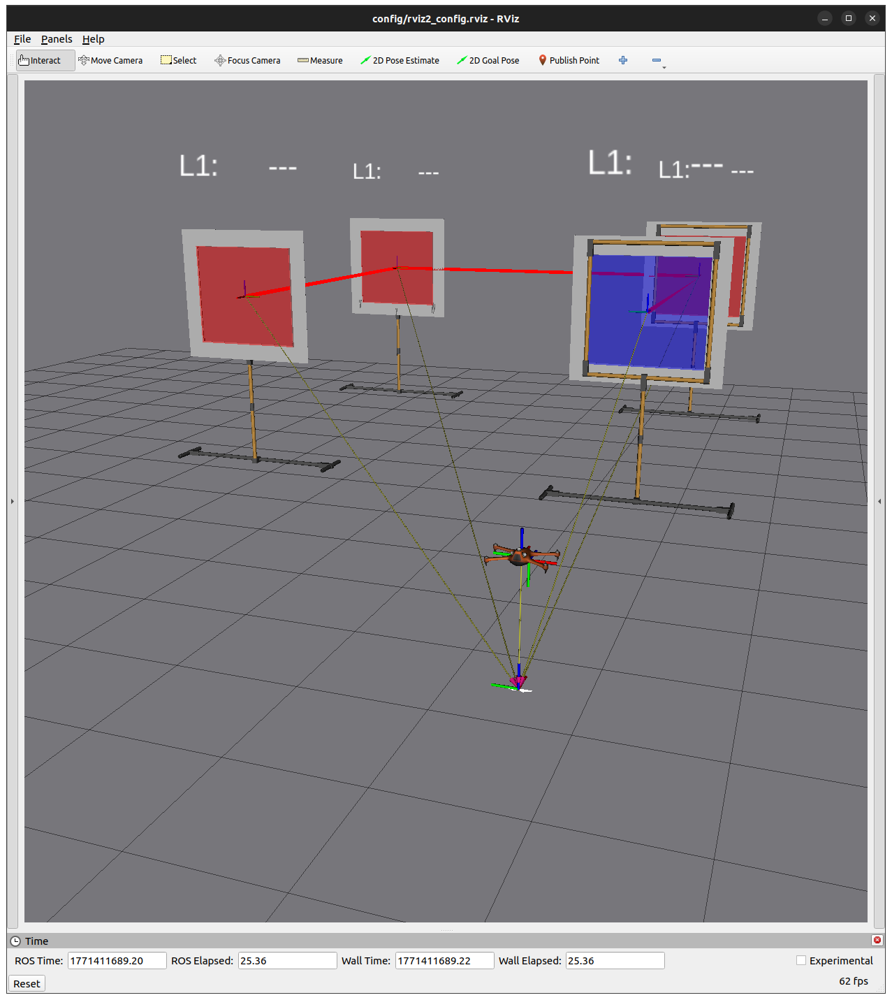

# Windows Installation (Docker)

This guide covers running the `control` track's Docker environment on **Windows**. Since ROS 2 Humble and Aerostack2 only support Linux natively, Docker is the recommended (and simplest) way to run this course on Windows.

> Note: X11 forwarding (used by the native Linux Docker flow via `xhost`) does not work on Windows the same way. On Windows, use **VNC Viewer** to access the container's desktop instead — this guide is written around that.

## 1. Prerequisites

- **Docker Desktop for Windows**, with the **WSL2 backend** enabled: [Docker Desktop Installation Guide](https://docs.docker.com/desktop/install/windows-install/)
  - During/after install, make sure WSL2 integration is enabled (Docker Desktop → Settings → General → "Use the WSL 2 based engine", and Settings → Resources → WSL Integration).
  - `docker compose` ships bundled with Docker Desktop, no separate install needed.
- **Git for Windows**: [Git for Windows](https://git-scm.com/download/win) (or use `git` from within WSL2).
- **VNC Viewer**: [RealVNC Viewer download](https://www.realvnc.com/en/connect/download/viewer/) — used to view the container's desktop (RViz, Gazebo, etc.).

You can run the commands below either from **PowerShell** or from a **WSL2 terminal (Ubuntu)**. WSL2 is recommended since paths and shell scripts (`launch_as2.bash`, `stop.bash`) behave the same way as on Linux.

## 2. Clone the Repository

PowerShell:

```powershell
cd $HOME
git clone https://github.com/cvar-upm-drone-team/project_cvar_upm_drone_course.git
```

WSL2 (Ubuntu):

```bash
cd ~
git clone https://github.com/cvar-upm-drone-team/project_cvar_upm_drone_course.git
```

## 3. Building and Running the Container

1. Navigate to the `control` directory:

```powershell
cd project_cvar_upm_drone_course\control
```

(or `cd ~/project_cvar_upm_drone_course/control` from WSL2)

2. Build the Docker image:

```powershell
docker compose build
```

3. Start the container:

```powershell
docker compose up -d
```

4. Connect to the container using `docker exec` in a new terminal:

```powershell
docker exec -it project_cvar_upm_drone_course_control bash
```

5. Build the workspace inside the container:

```bash
cd ~/project_cvar_upm_drone_course/control
cd drone_course_ws
colcon build --symlink-install
source install/setup.bash
```

## 4. Accessing the GUI (RViz / Gazebo) via VNC

Since native X11 forwarding isn't available on Windows, use VNC to see the container's desktop:

1. Make sure the container is running (`docker compose up -d`).
2. Open **VNC Viewer**.
3. Connect to `localhost:5901` (the container exposes VNC on port `5901`, as configured in `docker-compose.yaml`).
4. You should see the container's desktop, where RViz/Gazebo windows will appear once launched.

> You can ignore any instructions about `xhost +` or setting `DISPLAY`/`XAUTHORITY` — those only apply to the native Linux X11 flow, not the Windows/VNC flow.

## 5. Run the Course Environment

Inside the container (via `docker exec`, as in step 3.4):

```bash
cd ~/project_cvar_upm_drone_course/control
```

### Fix scripts format for Windows

Run the following commands to make the scripts executable:
```bash
sed -i 's/\r$//' launch_as2.bash
sed -i 's/\r$//' stop.bash
sed -i 's/\r$//' config/initialize.bash
```

### Launch simulation

```bash
./launch_as2.bash
```

Platform options:

- `-p ms`: Multirotor Simulator (default)
- `-p gz`: Gazebo

Examples:

```bash
./launch_as2.bash -p ms
./launch_as2.bash -p gz
```

Open VNC Viewer (connected to `localhost:5901`) to see a window like this:



## 6. Stop Simulation

Launch the stop script in the tmuxinator session, or in a new `docker exec` terminal:

```bash
./stop.bash
```

## Troubleshooting

- **Docker Desktop fails to start / WSL2 error**: Make sure virtualization is enabled in your BIOS and the WSL2 kernel update is installed ([Microsoft WSL install guide](https://learn.microsoft.com/en-us/windows/wsl/install)).
- **`docker compose` not found**: Update Docker Desktop to a recent version; `docker compose` (v2, no hyphen) is bundled by default.
- **VNC Viewer can't connect**: Confirm the container is running (`docker ps`) and that port `5901` isn't blocked by a firewall or already in use by another process on your machine.
- **Slow performance / file changes not syncing**: If cloning the repo onto the Windows filesystem (e.g. `C:\Users\...`) feels slow, clone it inside your WSL2 filesystem instead (e.g. `~` inside WSL2) and run Docker Desktop with the WSL2 backend for near-native performance.
