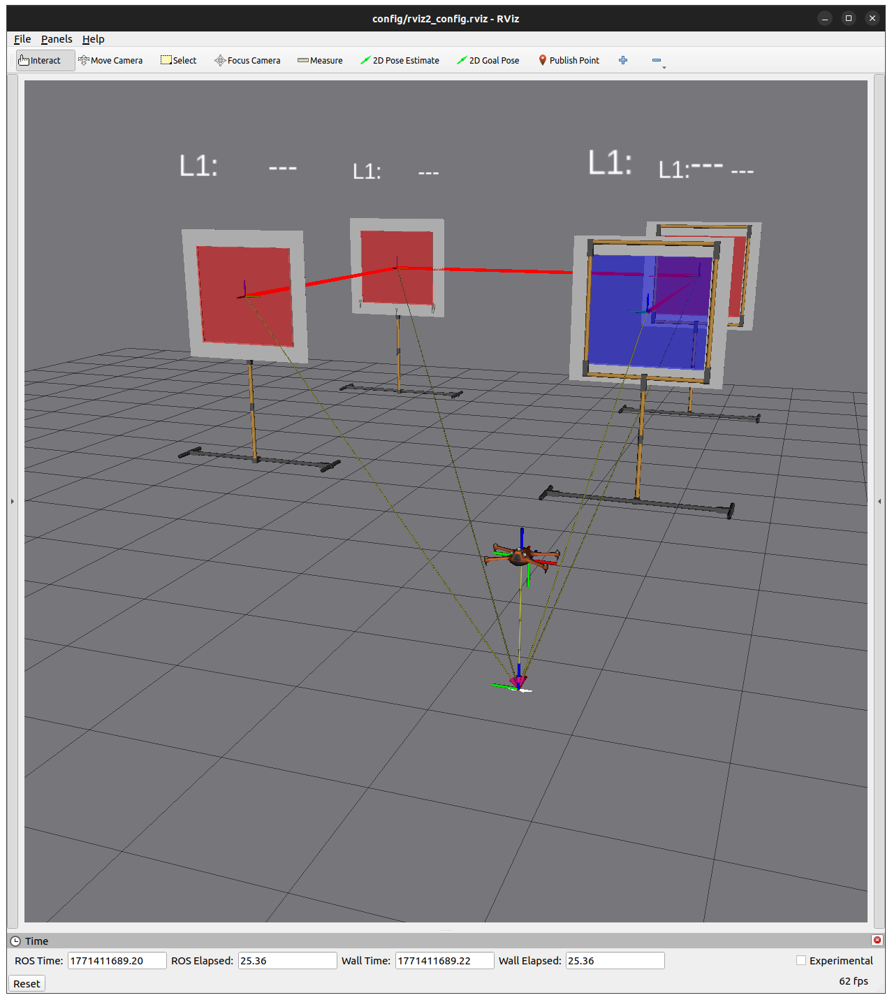
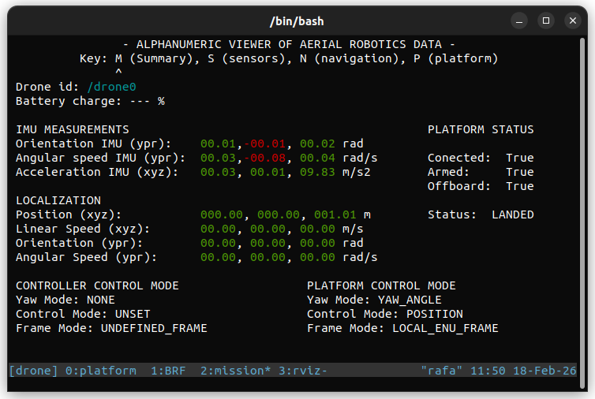

# Exercise 1: Drone Position Control

## Introduction

In this exercise, you will work through the basic ROS 2 control workflow for a drone:

1. Set the control mode to position.
2. Send position references (`setpoints`).
3. Verify the drone response using its estimated pose.

First, you will do this workflow manually with ROS 2 CLI tools. Then, you will automate it with your own ROS 2 node (Python or C++).



Simulation view.



Simulation data view (e.g., control mode and drone state).

## Guide for Section 1.1: Using ROS 2 CLI Tools

Objective: send position references from the terminal and verify that the drone follows them.

### Step 1. Launch the simulation

Start the simulation environment:

```bash
./launch_as2.bash
```

### Step 2. Change the control mode

Run:

```bash
ros2 service call /drone0/controller/set_control_mode as2_msgs/srv/SetControlMode "control_mode:
  header:
    stamp:
      sec: 0
      nanosec: 0
    frame_id: ''
  yaw_mode: 1
  control_mode: 2
  reference_frame: 1"
```

Indices used in the command:

- `control_mode: 2` -> `ControlMode.POSITION`
- `yaw_mode: 1` -> `ControlMode.YAW_ANGLE`
- `reference_frame: 1` -> `ControlMode.LOCAL_ENU_FRAME`

### Step 3. Publish position references

Publish to `/drone0/motion_reference/pose` with message type `geometry_msgs/msg/PoseStamped`.

Example:

```bash
ros2 topic pub /drone0/motion_reference/pose geometry_msgs/msg/PoseStamped \
"{header: {frame_id: 'earth'}, pose: {position: {x: 4.0, y: 0.0, z: 2.0}, orientation: {w: 1.0}}}" --once
```

### Step 4. Check the estimated drone state

Read the estimated pose from:

```bash
ros2 topic echo /drone0/self_localization/pose
```

## Guide for Section 1.2: Implementation with a ROS 2 Node

Objective: implement the same position-control workflow in your own node.
Code goal: complete the circuit by passing through the gates.

Choose one of these two paths:

- Python: complete the template in  `drone_controller.py`.
- C++: complete the template in `drone_course_ws/src/exercise_1` (package `exercise_1`).

Minimum node tasks:

1. Ask the gates position by the service.
2. Call the service to set the control mode to position.
3. Publish position references to `/drone0/motion_reference/pose` to guide the drone through the gates.
4. Read the estimated pose to verify tracking.

The template already includes a skeleton; complete the sections marked in comments with `TODO`.

## Running your node

First, initialize the simulation environment with:

```bash
./launch_as2.bash
```

Then, run your python node with:

```bash
python3 exercise_1.py
```

Or your C++ node, building it first with:

```bash
cd drone_course_ws
colcon build --symlink-install
source install/setup.bash
```

And then:
```bash
ros2 run exercise_1 exercise_1_node
```

## Submission

Submit your work in **one** of these formats:

- A link to a GitHub repository containing this repository with your exercise solution.
- A `.zip` file of this repository including your exercise solution.

Do not submit individual source files separately.

And also include a **video recording** of your node running in the simulation, showing the drone crossing the circuit.
You can use any screen recording tool for this.
