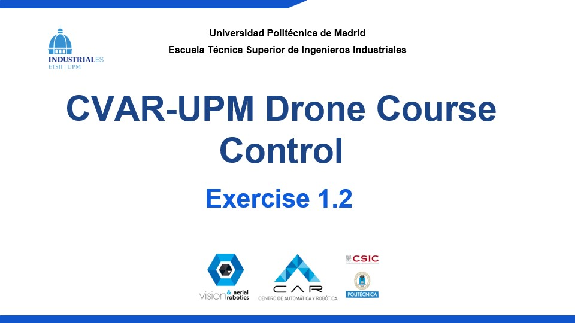

# Exercise 2: Drone Speed Control

## Introduction

In this exercise, you will work on speed control for the drone in ROS 2:

1. Set the controller to speed mode.
2. Send speed references from CLI tools.
3. Implement the same workflow in your own node.


Simulation view.


Simulation data view (e.g., control mode and drone state).

## Guide for Section 2.1: Using ROS 2 CLI Tools

Objective: send speed commands from terminal and verify the drone response.

Example video for section 2.1:

[](https://youtu.be/C9yj270ExEo)

### Step 1. Launch the simulation

Start the simulation environment:

```bash
./launch_as2.bash
```

### Step 2. Change the control mode to speed

Run:

```bash
ros2 service call /drone0/controller/set_control_mode as2_msgs/srv/SetControlMode "control_mode:
  header:
    stamp:
      sec: 0
      nanosec: 0
    frame_id: ''
  yaw_mode: 2
  control_mode: 3
  reference_frame: 1"
```

Indices used in the command:

- `control_mode: 3` -> `ControlMode.SPEED`
- `yaw_mode: 2` -> `ControlMode.YAW_SPEED`
- `reference_frame: 1` -> `ControlMode.LOCAL_ENU_FRAME`

### Step 3. Publish speed references

Publish to `/drone0/motion_reference/twist` with message type `geometry_msgs/msg/TwistStamped`.

Example:

```bash
ros2 topic pub /drone0/motion_reference/twist geometry_msgs/msg/TwistStamped \
"{header: {frame_id: 'earth'}, twist: {linear: {x: 1.0, y: 0.0, z: 0.0}, angular: {x: 0.0, y: 0.0, z: 0.0}}}" --once
```

### Step 4. Check the estimated drone state

Read estimated speed from:

```bash
ros2 topic echo /drone0/self_localization/twist
```

Optionally, monitor position with:

```bash
ros2 topic echo /drone0/self_localization/pose
```

## Guide for Section 2.2: Implementation with a ROS 2 Node

Objective: implement a speed-control workflow in your own node.
Code goal: complete the circuit by passing through all gates.

Choose one of these two paths:

- Python: complete `exercise_2.py`.
- C++: complete the template in `drone_course_ws/src/exercise_2` (package `exercise_2`).

Minimum node tasks:

1. Request the gate path from the path service.
2. Call the control-mode service and set `SPEED` + `YAW_SPEED`.
3. Compute speed commands from position error (at least P control).
4. Add I and D terms to improve tracking performance.
5. Publish `TwistStamped` commands to `/drone0/motion_reference/twist`.

The template already includes a skeleton; complete the sections marked with `TODO`.

## Running your node

First, initialize the simulation environment:

```bash
./launch_as2.bash
```

Then, run your Python node:

```bash
python3 exercise_2.py
```

Or run your C++ node, building first:

```bash
cd drone_course_ws
colcon build --symlink-install
source install/setup.bash
```

And then:

```bash
ros2 run exercise_2 exercise_2_node
```

## Submission

Submit your work in **one** of these formats:

- A link to a GitHub repository containing this repository with your exercise solution.
- A `.zip` file of this repository including your exercise solution.

Do not submit individual source files separately.

Also include a **video recording** showing your node completing the circuit through the gates.
